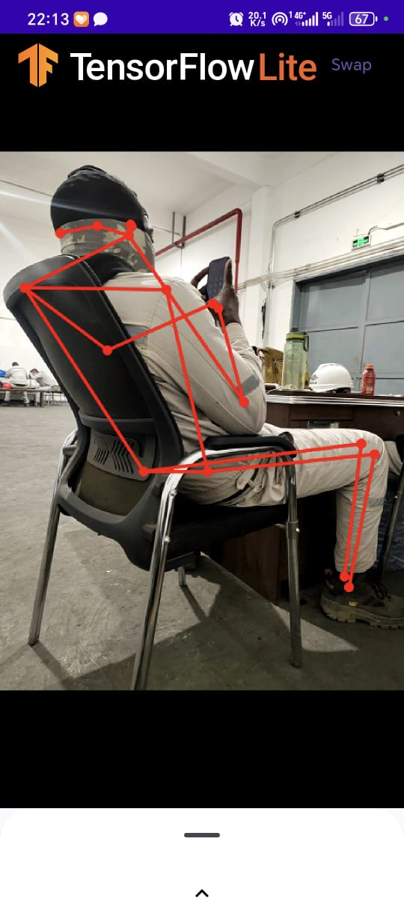

# TensorFlow Lite Pose Estimation with Pose Classification

A modernized Android application that performs real-time pose estimation and classification using TensorFlow Lite. This project builds upon the original Google TFLite Pose Estimation example, introducing modern Android development practices and advanced ML features.

## Key Contributions & Enhancements

This project has been significantly overhauled from the original source with the following additions:

*   **Jetpack Compose Migration**: The entire UI layer has been rewritten from the ground up using **Jetpack Compose** and **Material Design 3**. All legacy XML layouts and Fragments have been removed in favor of a modern, reactive, and declarative UI.
*   **Pose Classification Integration**: Beyond just detecting body parts, this app includes a custom **Pose Classification** engine. It uses a secondary TFLite model (`classifier.tflite`) to identify specific poses or exercises based on the keypoints provided by the pose detector.
*   **Coroutines-based Camera Logic**: The camera initialization and session management have been refactored to use **Kotlin Coroutines**. This simplifies asynchronous operations and improves the reliability of camera lifecycle handling.
*   **Camera Swapping**: Added support for switching between **Front and Back cameras** in real-time, complete with automatic UI rotation and mirroring for the front-facing lens.
*   **Modern Build System**: The project has been updated to use **Gradle 8.14** and **Android Gradle Plugin 8.13**, ensuring compatibility with the latest Android Studio features and build optimizations.

## How It Works

The application follows a modular pipeline to process frames and display results:

1.  **Frame Capture**: `CameraSource` utilizes Camera2 APIs to capture raw YUV frames.
2.  **Preprocessing**: Frames are converted to RGB and rotated/mirrored appropriately using `YuvToRgbConverter` and `Matrix` transformations.
3.  **Pose Estimation**: The selected model (MoveNet or PoseNet) processes the image to identify 17 body keypoints.
4.  **Pose Classification**: If enabled, the keypoints for the primary person are sent to `PoseClassifier.kt`. This model returns probabilities for specific poses defined in `labels.txt`.
5.  **Reactive UI**: The UI state (FPS, scores, and labels) is managed via Compose state, ensuring the display updates efficiently as new results arrive.

## Models Supported

The app supports four high-performance pose estimation models:

*   **MoveNet Lightning**: Optimized for speed, ideal for real-time mobile use.
*   **MoveNet Thunder**: Higher accuracy for complex movements.
*   **MoveNet MultiPose**: Detects and tracks up to 6 people simultaneously.
*   **PoseNet**: The classic model for single-person pose estimation.

## Setup & Installation

### Prerequisites

*   **Android Studio Jellyfish (2023.3.1)** or newer.
*   Android device running **API 23 (Marshmallow)** or higher.

### Building the Project

1.  Clone this repository.
2.  Open the `android` directory in Android Studio.
3.  Allow Gradle to sync. The project will automatically download the required TFLite models via `download.gradle`.
4.  Connect your Android device and click **Run**.

## Project Structure

*   `ml/`: Contains TFLite implementations for `PoseDetector` and the new `PoseClassifier`.
*   `ui/`: Entirely Compose-based UI components including `PoseEstimationContent` and `ControlPanel`.
*   `camera/`: Coroutine-powered `CameraSource` for hardware interaction.
*   `data/`: Data models for Persons, Keypoints, and Device configurations.

---

*Original Project Source: [TensorFlow Lite Pose Estimation Example](https://github.com/tensorflow/examples/tree/master/lite/examples/pose_estimation/android)*
